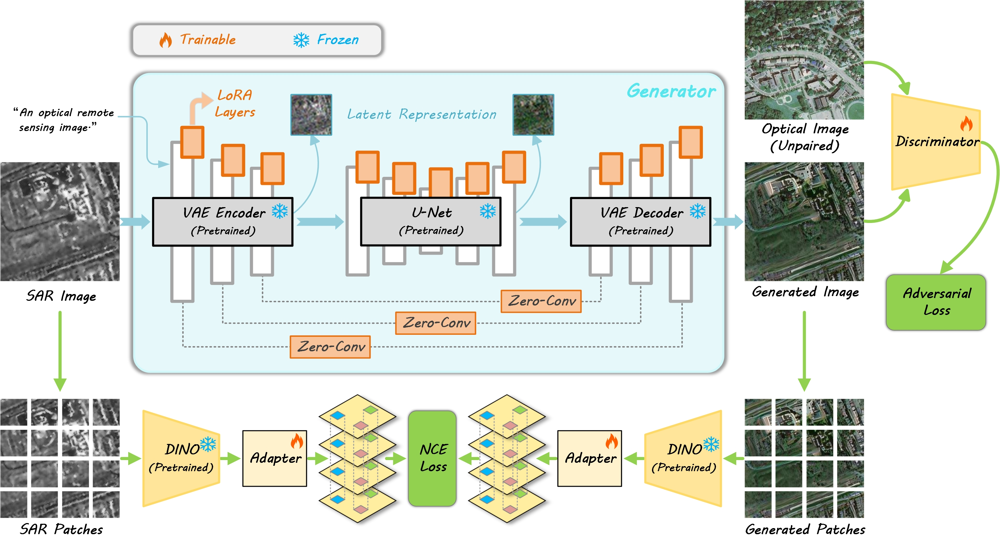
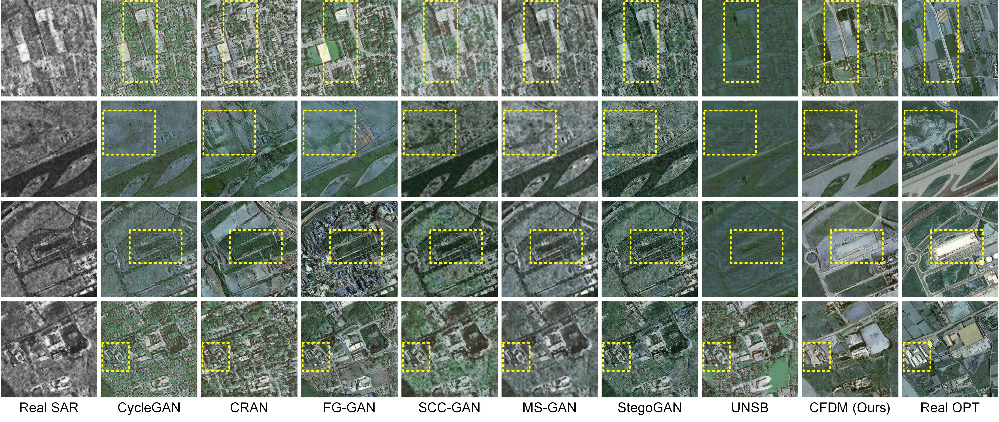

<div align="center">

# CFDM

**基于高效对比式微调LDM的单步无监督Sar2Opt图像翻译方法**

[**Efficient Contrastive Finetuning of Latent Diffusion Models for One-Step Unpaired SAR-to-Optical Image Translation**](https://ieeexplore.ieee.org/document/11690504)

[](https://www.python.org/)
[](https://pytorch.org/)
[](https://developer.nvidia.com/cuda-toolkit)
[](./LICENSE)

</div>

---

## 目录 / Table of Contents

- [1. 方法概述 (Introduction)](#1-方法概述-introduction)
- [2. 效果展示 (Visual Results)](#2-效果展示-visual-results)
- [3. 环境依赖 (Environment)](#3-环境依赖-environment)
- [4. 数据集准备 (Dataset)](#4-数据集准备-dataset)
- [5. 预训练权重 (Pretrained Weights)](#5-权重准备-pretrained-weights)
- [6. 快速运行 (Quick Start)](#6-快速运行-quick-start)
- [7. 引用论文 (Citation)](#7-引用论文-citation)

---

## 1. 方法概述 (Introduction)

 - 本工作面向SAR到光学图像转换（S2OIT）任务，基于预训练扩散模型构建参数高效微调方法，融合对抗学习、域自适应与对比学习联合优化生成器，兼顾图像像素保真、分布对齐与结构一致性。

 - 完整训练框架包含三大核心网络，分别为生成器、鉴别器和特征提取器。

 - 推理阶段只保留生成器模型即可实现单步图像风格翻译。

<p align="center">
  
</p>

---

## 2. 效果展示 (Visual Results)

<p align="center">
  
</p>

---

## 3. 环境依赖 (Environment)

| 组件 | 版本 | 说明 |
|:---|:---|:---|
| Python | **3.10.x** | 推荐 3.10 |
| PyTorch | **2.4.0** | 与 `xformers==0.0.27.post2` 严格对应 |
| torchvision | **0.19.0** | 与 torch 2.4.0 配套 |
| CUDA | **12.1** | 训练必需（DINOv2 依赖 xformers，仅支持 CUDA） |
| GPU 显存 | **≥ 24 GB** 推荐 | batch size=1 时约占用 18～22 GB |
| 操作系统 | Linux / Windows | 已在 CUDA 12.1 + PyTorch 2.4.0 下验证 |

```bash
# 一键安装
conda create -n CFDM python=3.10 -y
conda activate CFDM
pip install -r requirements.txt

# 安装校验
python -c "import torch, diffusers, peft, lpips, cleanfid, swanlab; print(torch.__version__, torch.cuda.is_available())"
```

---

## 4. 数据集准备 (Dataset)

### 4.1 数据要求 / Requirements

- **A 域（光学域，目标）**：彩色光学遥感图像（RGB）；
- **B 域（SAR 域，输入）**：灰度 SAR 图像；
- 两域图像**无需一一配对**（非配对训练）；但 `testA` 与 `testB` 建议文件名同名，
  以便计算 LPIPS。

### 4.2 目录结构 / Directory Layout

```
<your_dataset_path>/
├── fixed_prompt.txt        # 固定提示词
├── trainA/                 # 训练集 - 光学彩色图
├── trainB/                 # 训练集 - SAR 灰度图
├── testA/                  # 测试集 - 光学彩色图（参考）
└── testB/                  # 测试集 - SAR 灰度图（输入）
```

```text
# fixed_prompt.txt
an optical remote sensing image
```

---

## 5. 权重准备 (Pretrained Weights)

本工作使用了以下预训练模型：

 [SD-Turbo](https://huggingface.co/stabilityai/sd-turbo)、
 [DINOv2](https://github.com/facebookresearch/dinov2)、
 Inception / LPIPS (首次用到时自动下载) 

---

## 6. 快速运行 (Quick Start)
### 6.1 训练 / Train

```bash
# 首次使用需要到src/config.py中修改dataset_dict，之后指定数据集名称即可开始训练
python train.py --dataset_name your_dataset_name
```

训练日志与指标记录使用 **swanlab**（首次使用需登录，具体请了解官方文档[swanlab](https://docs.swanlab.cn/guide_cloud/general/what-is-swanlab.html)）

### 6.2 单张图像推理 / Single-image Inference

```bash
python infer.py --checkpoint your_checkpoint_path/model_5001.pkl \
    --input your_sar_image_path.png \
    --save_comparison
```
### 6.3 文件夹批量推理 / Batch Inference

```bash
python infer.py --checkpoint checkpoints/model_5001.pkl \
    --input data/your_image_folder_path 
```

---

## 7. 引用论文 (Citation)

如果本工作对你的研究有帮助，请引用：

```bibtex
@article{yuweb2026spl,
  title   = {Efficient Contrastive Finetuning of Latent Diffusion Models for One-Step Unpaired SAR-to-Optical Image Translation},
  author  = {Wenbo Yu, Tian Tian, Jiamu Li, Feng Zhou},
  journal = {IEEE Signal Processing Letters},
  year    = {2026},
}
```

---

## 致谢 / Acknowledgements

本工作的实现特别受益于以下开源工作：
[sar2opt](https://github.com/MarsZhaoYT/SAR2Opt-Heterogeneous-Dataset)、
[sen12](https://arxiv.org/abs/1906.07789)、
[img2img-turbo](https://github.com/GaParmar/img2img-turbo)、
[SD-Turbo](https://huggingface.co/stabilityai/sd-turbo)、
[diffusers](https://github.com/huggingface/diffusers)、
[peft](https://github.com/huggingface/peft)、
[accelerate](https://github.com/huggingface/accelerate)、
[DINOv2](https://github.com/facebookresearch/dinov2)、
[DINO](https://github.com/facebookresearch/dino)、
[vision-aided-loss](https://github.com/nupurkmr9/vision_aided_loss)、
[clean-fid](https://github.com/GaParmar/clean-fid)、
[lpips](https://github.com/richzhang/PerceptualSimilarity)。


